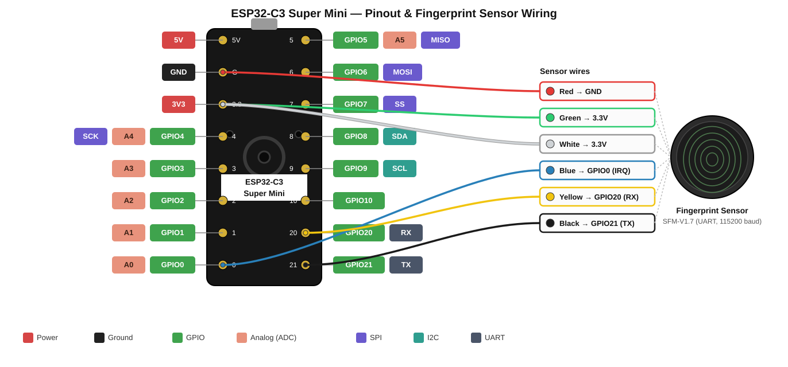

# Fingerprint Keyboard

A fingerprint-gated "keyboard". Touch the sensor with a registered finger and your
password is typed into the focused window on your PC. No password is stored or
typed until your fingerprint matches.

## Idea

An ESP32-C3 SuperMini reads a fingerprint sensor. When a fingerprint matches, the
board sends the password for that user over your local WiFi as an encrypted UDP
packet. A small Python daemon on the PC receives it, decrypts it, and types it
using `wtype` — so it works anywhere (login screens, browsers, terminals).

## Hardware

- ESP32-C3 SuperMini
- SFM-V1.7 Semiconductor Integrated Touch Capacitive Acquisition And
  Identification Fingerprint Sensor Module (UART communication, 115200 baud)

| Sensor | ESP32-C3 |
|--------|----------|
| Yellow (TXD) | GPIO 20 (UART RX) |
| Black (RXD)  | GPIO 21 (UART TX) |
| Blue (touch) | GPIO 0 (IRQ) |
| Green (3.3V) | 3.3V |
| White (3.3V) | 3.3V |
| Red (GND)    | GND |



Requires the **SFM-V1.7** library by Matrixchung (`#include "sfm.hpp"`,
class `SFM_Module`).

## ESP32 Setup

Create the file `fingerprint_keyboard/secrets.h` with this template and fill in
the real values (`WIFI_SSID`, `WIFI_PASS`, `SERVER_HOST` = your PC's IP,
`AUTH_TOKEN`, `XOR_KEY`, and `PASSWORD_1`/`PASSWORD_2`, one per enrolled finger):

```cpp
#ifndef SECRETS_H
#define SECRETS_H

#define WIFI_SSID    "your-wifi-ssid"
#define WIFI_PASS    "your-wifi-password"
#define SERVER_HOST  "SERVER_HOST"
#define AUTH_TOKEN   "your-token"
#define XOR_KEY      "your-key"

const char PASSWORD_1[] = "password-for-finger-1";
const char PASSWORD_2[] = "password-for-finger-2";

#endif
```

This file is gitignored, so your credentials stay out of the repository. For extra
security, `secrets.h` is owned by `root:root` with mode `600` (root-only), so
building and flashing **require sudo**:

```bash
make flash    # prompts for your sudo password
make monitor  # optional, serial output
```

The Makefile wraps `arduino-cli` with `sudo` (keeping `HOME` so your esp32 cores
and libraries are still found). To edit the secrets: `sudo nano fingerprint_keyboard/secrets.h`.

Serial commands: `e` = enroll a finger (3 presses), `d` = delete all users.

## PC Setup (daemon)

```bash
sudo pacman -S wtype        # Wayland-compatible keystroke typer
cd typer
python3 -m venv venv        # optional
nano .env                   # set AUTH_TOKEN and XOR_KEY (must match the ESP32)
python3 typer.py            # run it and keep it open
```

To auto-start the daemon on login, add to `~/.config/hypr/autostart.conf` (Hyprland):

```
exec-once = bash -c 'while true; do python3 /path/to/typer/typer.py >> /tmp/typer.log 2>&1; sleep 2; done'
```

This is written for a Hyprland setup, but the daemon is just a Python script — it
works equally well under systemd (e.g. a `systemd --user` service). The Hyprland
`exec-once` wrapper was simply more convenient here.

## Security notes

- `AUTH_TOKEN` and `XOR_KEY` must match between the ESP32 and `typer/.env`.
- The XOR "encryption" only hides the password from casual sniffing — treat it as
  obfuscation, not strong crypto.
- Open UDP port `4444` on your PC's firewall only to the ESP32 (e.g.
  `sudo ufw allow from 192.168.0.204 to any port 4444 proto udp`).
